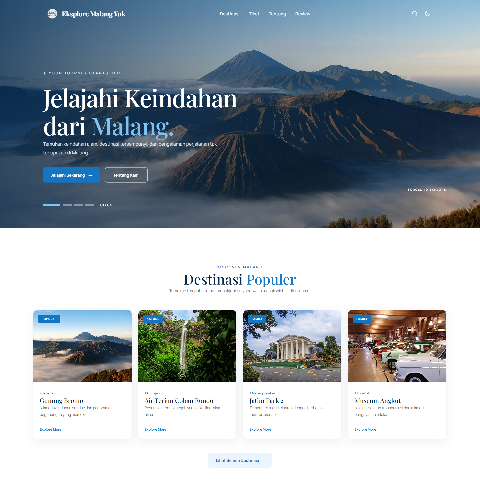

<div align="center">

  

# Eksplore Malang Yuk

**Jelajahi Malang Raya. Temukan tempatnya. Rasakan pengalamannya.**

Website informasi wisata Malang Raya yang menghadirkan destinasi alam,
wisata edukasi, hiburan, hingga informasi perjalanan dalam satu tempat.

  <br>

  
  
  

<br><br>

  

</div>

---

## 📖 Tentang Proyek

**Eksplore Malang Yuk** adalah website statis yang menyediakan informasi mengenai berbagai destinasi wisata di **Malang Raya, Jawa Timur**.

Proyek ini dibuat sebagai tugas **IT Incubation Project — Kelompok 1** dengan tujuan memperkenalkan potensi wisata Malang melalui website yang sederhana, informatif, responsif, dan mudah digunakan.

Beberapa destinasi yang diperkenalkan antara lain:

* 🏔️ Gunung Bromo
* 🌊 Air Terjun Coban Rondo
* 🚗 Museum Angkut
* 🦁 Jatim Park 2
* 🌿 Berbagai destinasi wisata lainnya

Informasi yang tersedia meliputi deskripsi destinasi, kategori wisata, referensi harga tiket, serta ulasan pengunjung.

Website dibangun menggunakan **HTML, CSS, dan JavaScript murni (Vanilla JavaScript)** tanpa framework maupun proses build sehingga proyek dapat dipelajari dan dijalankan dengan mudah.

---

## ✨ Fitur

### 🎨 Tema Terang & Gelap

* Mendukung **Light Mode** dan **Dark Mode**.
* Mengikuti preferensi sistem melalui `prefers-color-scheme`.
* Pilihan tema disimpan menggunakan `localStorage`.
* Tema tetap konsisten ketika berpindah halaman.
* Menggunakan key:

```text
pesona-malang-theme
```

### 🔎 Pencarian Destinasi

Fitur pencarian tersedia melalui navbar dan dapat:

* mencari destinasi secara langsung,
* menyorot kata kunci pada kartu,
* bekerja tanpa reload halaman,
* mengabaikan perbedaan huruf besar dan kecil,
* mengabaikan perbedaan aksen.

### 🏷️ Filter Kategori

Halaman tiket menyediakan filter berdasarkan kategori:

```text
Semua
Alam
Non-alam
```

Jumlah hasil pencarian juga ditampilkan secara otomatis.

### 🖼️ Hero Slider

Halaman beranda memiliki hero slider dengan:

* 4 slide,
* pergantian otomatis setiap 5 detik,
* indikator slide,
* penghitung slide,
* video latar,
* pemutaran video hanya ketika slide aktif,
* optimasi menggunakan `IntersectionObserver`.

### ✨ Scroll Reveal

Elemen dengan class `.reveal` akan muncul secara halus ketika memasuki area viewport.

Animasi juga menghormati preferensi pengguna melalui:

```css
prefers-reduced-motion
```

### 📱 Responsive Navigation

Navbar beradaptasi dengan ukuran layar:

* Desktop navigation
* Mobile hamburger menu
* Menu tertutup setelah memilih link
* Menu dapat ditutup menggunakan tombol `Esc`

### ⬆️ Back to Top

Tombol kembali ke atas muncul setelah pengguna melakukan scroll lebih dari **320px**.

### ♿ Accessibility

Website memperhatikan beberapa aspek aksesibilitas, antara lain:

* Skip Link
* `aria-label`
* `aria-expanded`
* `aria-pressed`
* `aria-live`
* Focus management
* Dukungan `prefers-reduced-motion`

---

## 📄 Halaman

| Halaman           | File             | Deskripsi                                                   |
| ----------------- | ---------------- | ----------------------------------------------------------- |
| 🏠 Beranda        | `index.html`     | Hero slider, destinasi populer, keunggulan layanan, dan CTA |
| 🗺️ Destinasi     | `destinasi.html` | Daftar destinasi alam dan non-alam                          |
| 🎟️ Tiket         | `tiket.html`     | Informasi harga tiket dan filter kategori                   |
| 📖 Tentang Malang | `tentang.html`   | Cerita, sejarah, dan kehidupan Kota Malang                  |
| ⭐ Review          | `review.html`    | Ulasan pengunjung dan rating destinasi                      |

---

## 🛠️ Teknologi

| Teknologi                 | Penggunaan                                   |
| ------------------------- | -------------------------------------------- |
| **HTML5**                 | Struktur halaman dan semantic markup         |
| **CSS3**                  | Layout, responsive design, animasi, dan tema |
| **Vanilla JavaScript**    | Interaksi dan logika antarmuka               |
| **Google Fonts**          | Manrope & Playfair Display                   |
| **Phosphor Icons**        | Ikon antarmuka                               |
| **Web Storage API**       | Menyimpan preferensi tema                    |
| **IntersectionObserver**  | Scroll reveal dan optimasi video             |
| **CSS Custom Properties** | Design tokens dan sistem tema                |

### 🎨 Design System

Token warna, tipografi, dan semantic roles dipusatkan pada:

```text
css/global.css
```

Warna utama website:

```text
#1675C1
```

Warna rating bintang dibuat berbeda dari warna utama agar memiliki makna visual tersendiri.

---

## 📁 Struktur Proyek

```text
.
├── index.html
├── destinasi.html
├── tiket.html
├── tentang.html
├── review.html
│
├── css/
│   ├── global.css
│   ├── site.css
│   ├── page.css
│   ├── beranda.css
│   ├── destinasi.css
│   ├── tiket.css
│   ├── tentang.css
│   └── review.css
│
├── js/
│   ├── site.js
│   ├── beranda.js
│   ├── destinasi.js
│   └── tiket.js
│
└── aset/
    ├── Logo/
    │   ├── logo.png
    │   └── logo-inverse.png
    │
    ├── img/
    │   └── foto wisata & landmark Malang
    │
    ├── video/
    │   └── video hero Gunung Bromo
    │
    ├── favicon.ico
    ├── favicon.png
    └── apple-touch-icon.png
```

---

## 📂 Struktur CSS

| File            | Tanggung Jawab                                   |
| --------------- | ------------------------------------------------ |
| `global.css`    | Reset, design tokens, typography, theme, utility |
| `site.css`      | Navbar dan footer                                |
| `page.css`      | Layout halaman dalam dan pola section            |
| `beranda.css`   | Hero slider, kartu destinasi, CTA                |
| `destinasi.css` | Tampilan halaman destinasi                       |
| `tiket.css`     | Tampilan dan filter tiket                        |
| `tentang.css`   | Tampilan khusus halaman tentang                  |
| `review.css`    | Tampilan review pengunjung                       |

---

## ⚙️ Struktur JavaScript

| File           | Tanggung Jawab                               |
| -------------- | -------------------------------------------- |
| `site.js`      | Tema, navbar, pencarian, filter, back-to-top |
| `beranda.js`   | Hero slider, video, scroll reveal            |
| `destinasi.js` | Detail informasi destinasi                   |
| `tiket.js`     | Pencarian dan filter tiket                   |

---

## 🚀 Menjalankan Proyek

Proyek ini **tidak membutuhkan proses build** dan tidak memiliki dependency yang harus di-install.

Cukup jalankan menggunakan static server.

### 1. VS Code — Live Server

Buka folder proyek menggunakan VS Code.

Kemudian:

```text
Klik kanan index.html
        ↓
Open with Live Server
```

Website biasanya tersedia di:

```text
http://127.0.0.1:5500/index.html
```

### 2. Python HTTP Server

Jika Python sudah terinstall:

```bash
python -m http.server 5500
```

Kemudian buka:

```text
http://localhost:5500
```

### 3. XAMPP / Apache

Letakkan folder proyek ke:

```text
htdocs/
```

Kemudian akses:

```text
http://localhost/nama-folder/
```

### ⚠️ Mengapa Menggunakan Server?

Website sebaiknya dijalankan melalui server lokal, bukan langsung menggunakan:

```text
file:///
```

Beberapa asset pada website menggunakan path seperti:

```text
/aset/img/bromo.webp
```

Path tersebut bergantung pada root server sehingga dapat menghasilkan masalah ketika halaman dibuka langsung menggunakan `file://`.

---

## 🧩 Catatan Pengembangan

### Urutan CSS

Urutan stylesheet pada setiap halaman harus dipertahankan:

```text
global.css
    ↓
site.css
    ↓
stylesheet khusus halaman
```

`global.css` harus dimuat terlebih dahulu karena berisi token desain, reset, typography, dan aturan tema.

### Path Asset

Halaman selain beranda menggunakan path relatif:

```text
./aset/...
```

Pastikan path asset disesuaikan dengan lokasi halaman.

### Theme Bootstrap

Script kecil ditempatkan pada `<head>` setiap halaman.

Script tersebut membaca:

1. Tema yang tersimpan di `localStorage`.
2. Preferensi `prefers-color-scheme`.

Tujuannya adalah menentukan tema sebelum halaman selesai dirender sehingga mengurangi kemungkinan **Flash of Wrong Theme (FOWT)**.

### Global Search

`js/site.js` menangani pencarian pada beberapa jenis kartu:

```text
.destination-card
.destination-list .card
.review-card
```

Dengan pendekatan tersebut, mekanisme pencarian dapat digunakan pada beberapa halaman tanpa perlu membuat ulang sistem pencarian.

### Menambahkan Halaman Baru

Untuk menambahkan halaman baru:

1. Muat `global.css`.
2. Muat `site.css`.
3. Gunakan struktur `<header>` dan `<footer>` yang konsisten.
4. Buat stylesheet khusus jika diperlukan.
5. Buat JavaScript khusus jika halaman memiliki interaksi tersendiri.
6. Pastikan halaman tetap menggunakan sistem tema dan responsive design yang sudah ada.

---

## 👥 Kontributor

### Kelompok 1

| Nama    |
| ------- |
| Sheila  |
| Zhorif  |
| Raissa  |
| Zaky    |
| Zakiyya |

---

## 🎓 Informasi Proyek

| Informasi       | Detail                  |
| --------------- | ----------------------- |
| **Nama Proyek** | Eksplore Malang Yuk     |
| **Jenis**       | Static Website          |
| **Project**     | IT Incubation Project   |
| **Kelompok**    | Kelompok 1              |
| **Lokasi**      | Malang Raya, Jawa Timur |
| **Tahun**       | 2026                    |
| **Teknologi**   | HTML5, CSS3, JavaScript |

---

<div align="center">

**Made with HTML, CSS & JavaScript ❤️**

Jelajahi Malang. Kenali destinasinya. Nikmati perjalanannya.

  <br>

<sub>© 2026 Eksplore Malang Yuk · Informasi wisata — bukan layanan pemesanan tiket.</sub>

</div>
